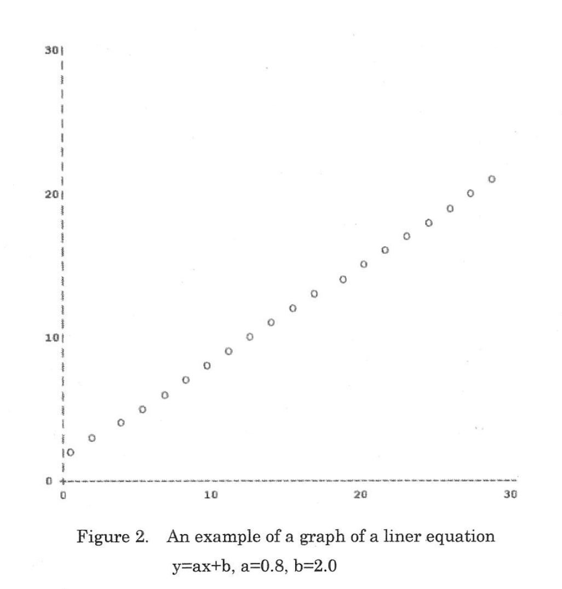
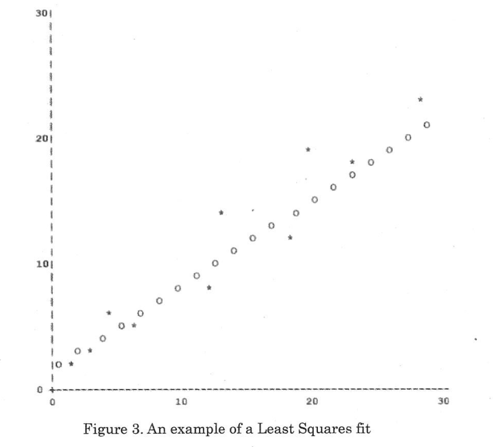

# 东京大学创造信息学 2012 冬季编程测试

## 编程

编写一个程序，能够绘制包含 N 个数据元素的图表，并计算这些数据的最小二乘近似。
每条数据以 $(x, y)$ 表示，$x, y$ 为满足 $0 ≤ x < 30$、$0 ≤ y < 30$ 的整数。
随附的 USB 存储器中包含两组各 30 条的数据，格式如下：

```
(2, 10)
(23, 1)
...
(15, 23)
```

(1) USB 中的 data1.txt 含有 30 条数据。
编写程序读取 data1.txt 的全部数据，并输出 $y$ 值最大的 $(x, y)$。

(2) 将 data1.txt 中全部数据绘制成图（参见图 1）。

(3) 编写程序，使用 ASCII 字符绘制线性方程
  y = ax + b 其中 0 ≤ x < 30，0 ≤ y < 30。
以 a = 0.5、b = 10 为测试用例绘制图像。
绘图用到的字符可自行选择（参见图 2）。

(4) 计算 data1.txt 数据的最小二乘拟合直线 y = ax + b，并将结果绘制在图上（参见图 3）。

直线的系数 a、b 由下式给出：

$$
a = \frac{N\sum x_k y_k - \sum x_k \sum y_k}{N\sum x_k^2 - (\sum x_k)^2}
$$

$$
b = \frac{\sum x_k^2 \sum y_k - \sum x_k y_k \sum x_k}{N\sum x_k^2 - (\sum x_k)^2}
$$

其中输入为 $(x_k, y_k)，k = 0, …, N−1$。

---

(5) 编写程序，针对 data2.txt，求出两条线性方程的系数 $a_1, b_1, a_2, b_2$ 以及 $x_m$，使得
$$y = a_1x + b_1, 0 ≤ x < x_m$$
 以及 $$y = a_2x + b_2, x_m ≤ x < 30$$
在两段拼接点相连并令平方误差和最小。
这里两条线必须在 $x_m$ 处连续。
平方误差和定义如下：

$$
F(x) =
\begin{cases}
a₁x + b₁, & 0 ≤ x < xₘ \\
a₂x + b₂, & xₘ ≤ x < 30
\end{cases}
$$

且

$$
a₁xₘ + b₁ = a₂xₘ + b₂
$$

$$
E = \sum_{k=0}^{N-1} (y_k - F(x_k))^2
$$

其中 $F(x_k)$ 表示近似直线在 $x_k$ 处的 y 值。

---

**图 1.** 文件数据绘图示例  


---

**图 2.** 线性方程绘图示例  
  y = ax + b, a = 0.8, b = 2.0  


---

**图 3.** 最小二乘拟合示例  


---
