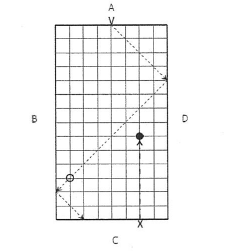
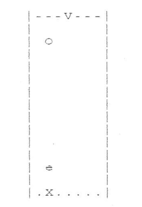

# University of Tokyo, Creative Informatics, 2012-summer coding test

制作一个供单个玩家游玩的射击游戏，具体步骤如下：

这个射击游戏在一个由A、B、C、D四条线段包围的 9×15 网格坐标的棋盘上进行（如图1）。玩家控制位于C线段上的枪，向从上方向下移动的目标发射子弹。玩家的得分取决于游戏过程中击落目标的数量。

目标最初从线段A上的网格点V以45度的右下方向抛出。目标每单位时间向下移动一个网格坐标，同时向水平方向移动一个网格坐标。线段B和D的反射指数为1.0，因此目标碰撞后的反射角度等于入射角度。当目标到达线段C时，目标消失，游戏分数不变。

玩家使用键盘上的 i, j, k 或 l 键来控制枪的位置和射击动作。各按键功能如下（假设每次只按下一个键）：

* **i 键**：
  发射子弹，然后更新棋盘。

* **j 键**：
  将枪在C线段上向左移动一个网格位置，然后更新棋盘。
  如果枪已位于C线段的最左位置，则枪的位置不变，仅更新棋盘。

* **k 键**：
  更新棋盘，但不对枪的位置进行任何操作。

* **l 键**：
  将枪在C线段上向右移动一个网格位置，然后更新棋盘。
  如果枪已位于C线段的最右位置，则枪的位置不变，仅更新棋盘。

除了 i、j、k、l 键外，其他所有按键输入都会被忽略。假定在每次按下 i、j、k、l 键后都会立即按下回车键（CR键）。

---

显示当前棋盘的方法可以采用图形显示或字符显示。当以字符显示棋盘时，使用 "-", "|", "\", "/" 和空格来表示A、B、C、D各线段，内部网格点可不显示。从线段A投出目标的位置用 "V" 表示，枪在C线段的位置用 "X" 表示，目标的位置用 "O" 表示，子弹的位置用 "•" 表示。图2展示了使用字符方式显示棋盘时的游戏界面快照。显示棋盘可采用以下三种方法中的一种。如果选择方法2或方法3，将获得额外加分：

* 方法1：字符显示，每次更新时都重新显示整个棋盘。
* 方法2：字符显示，每次更新时仅替换需要修改位置上的字符。
* 方法3：图形显示，使用位图的图形表示方法。

游戏开始时棋盘上没有目标。每次棋盘更新时，如果没有目标，则从点V抛出一个新目标。此后，每次更新棋盘时目标都会向垂直和水平方向各移动一个网格坐标。

当玩家按下 i 键时，枪发射一颗子弹，此后子弹每次棋盘更新时都会直线上升一个网格坐标。当子弹击中目标时，子弹和目标都从棋盘上消失，并且玩家得分加1。当子弹未击中目标而抵达线段A时，子弹消失。玩家对每次目标抛出最多可发射两颗子弹。如果玩家想要移动枪的位置，可以按下 j 或 l 键。

当玩家未能击中目标，且目标在C线段上累计消失5次后，游戏结束。游戏结束时，程序显示游戏得分后终止。

(1) 编写一个程序，显示棋盘，但不包含任何子弹和目标。

(2) 编写一个程序，从线段A的中央位置以45度的右下方向投出目标，并在每次更新棋盘时使目标向下移动。当目标到达线段C时，目标消失。当棋盘上没有目标时，从线段A的中央再次投出一个新目标。

(3) 编写一个程序，使枪位于线段C的中央。当玩家按下 i 键时，枪向上发射子弹。此后每次更新棋盘时子弹向上移动一个网格坐标并重新显示棋盘。当子弹与目标碰撞时，程序清除子弹和目标，并使游戏得分增加1。

(4) 修改步骤(3)的程序，使目标从线段A上所有网格点中随机等概率地选择一个位置抛出。

(5) 制作一个完整的射击游戏程序，按下 j 或 l 键时，枪在C线段上移动；按下 i 键时，枪发射子弹。

(6) 到目前为止，棋盘更新和按键输入是同步进行的，这使得游戏程序显得复杂。为了使该程序更接近真实的游戏机，需将棋盘的更新与按键操作相互独立，即棋盘的更新周期性地进行，而移动枪和发射子弹的操作直接通过键盘输入进行控制。在答题纸上描述完成此要求的必要修改方法。

(7) 修改至今所完成的程序，使其在无需按任何键的情况下每隔0.5秒周期性更新棋盘，当按下 j 或 l 键时枪移动一个网格坐标，按下 i 键时枪发射子弹。

---
