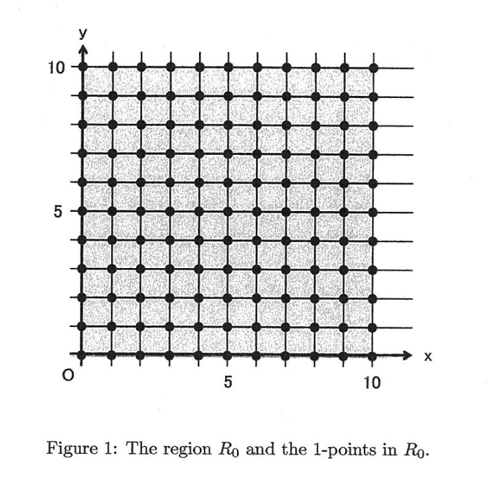
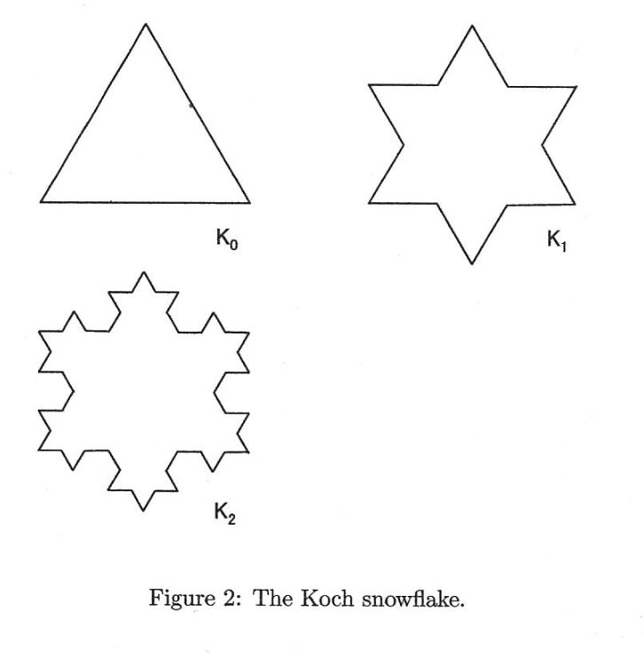

# 编程

$d$ 点集合定义为 $\{(dp, dq) \mid p \in Z, q \in Z\}$，其中 $Z$ 是包含负整数在内的所有整数的集合。$A(d, R)$ 表示既属于 $d$ 点集合又位于给定区域 $R$ 内的点的个数。设区域 $R_0$ 内的点 $(x,y)$ 满足以下不等式：

$$
R_0: 0 \leq x \leq 10 \quad \text{and} \quad 0 \leq y \leq 10.
$$

则如图 1 所示，有 $A(1, R_0)$ 为 121。

(1) 编写程序，对于给定的浮点数 $d$ 计算 $A(d, R_0)$。

(2) 区域 $R_1$ 内的点 $(x, y)$ 满足以下不等式：

$$
R_1: (x-5)^2 + (y-5)^2 \leq 5^2.
$$

编写程序，对于给定的浮点数 $d$ 计算下式的值：

$$
\frac{A(d, R_1)}{A(d, R_0)} \times \frac{1}{4}
$$

(3) Koch 雪花（图 2）可以按如下步骤从一个正三角形开始递归构造：

1. 将线段分成三段长度相等的线段。
2. 以步骤 1 得到的中间那一段为底边，向外作一个正三角形。
3. 删除步骤 2 中该正三角形的底边线段。

*(摘自维基百科, http://en.wikipedia.org/wiki/Koch_snowflake)*

区域 $K_n$ 是这样得到的图形（顶点为 $(0, 0), (10, 0), (5, 5\sqrt{3})$ 的三角形），经过上述步骤迭代 $n$ 次后内部的区域。此图形的边界也包含在 $K_n$ 中。

编写程序，输出 $K_2$ 的面积。答案必须为浮点数。

(4) 编写程序，对于给定的正整数 $n$ 计算 $K_n$ 的面积。答案必须为浮点数。

(5) 编写程序，对于给定的浮点数 $d$ 计算 $A(d, K_2)$。

(6) 编写程序，对于给定的浮点数 $d$ 和正整数 $n$ 计算 $A(d, K_n)$。

